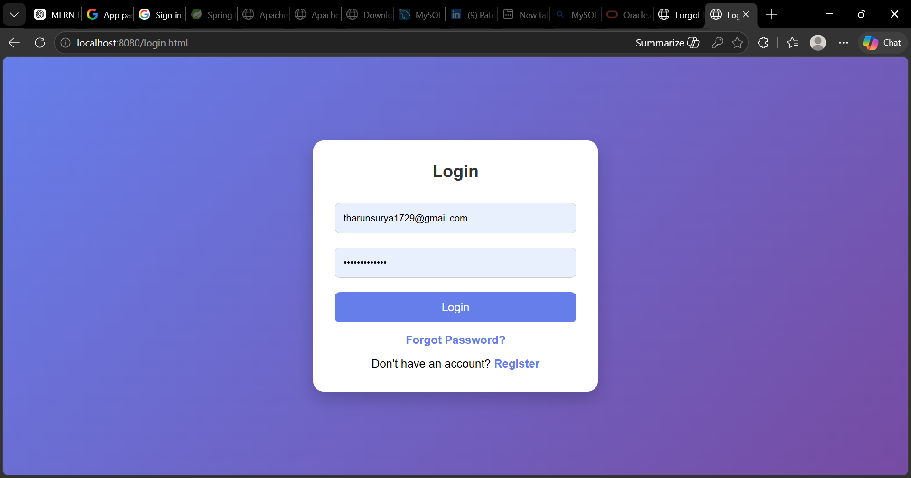
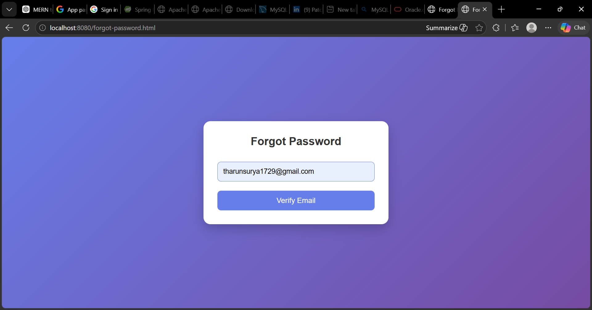
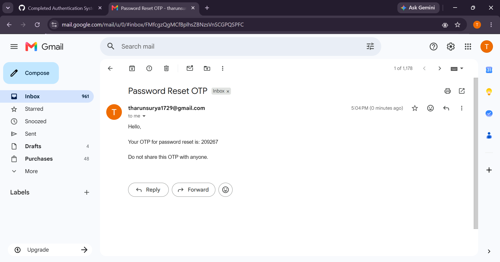
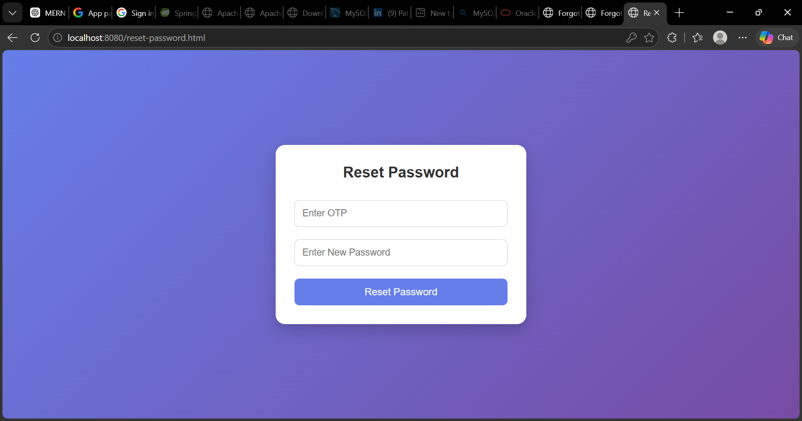
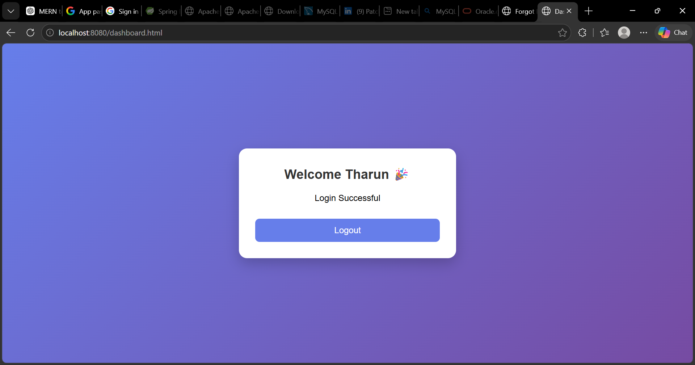

# Java FSE Authentication System

A Full Stack Authentication System built using Spring Boot, MySQL, HTML5, CSS3 and JavaScript.

## Features

* User Registration
* User Login
* BCrypt Password Encryption
* Forgot Password
* OTP Verification through Gmail
* Password Reset
* Dashboard
* Logout
* MySQL Database Integration
* Spring Boot REST APIs

## Technologies Used

### Backend

* Java
* Spring Boot
* Spring Security
* Spring Data JPA
* MySQL

### Frontend

* HTML5
* CSS3
* JavaScript

### Email Service

* Gmail SMTP
* Java Mail Sender

## Project Architecture

Frontend (HTML/CSS/JS)

↓

Spring Boot REST APIs

↓

Service Layer

↓

JPA Repository

↓

MySQL Database

↓

Gmail SMTP

## Screenshots

### Login Page

### Forgot Password

### OTP Email

### Reset Password

### Dashboard

## Author

Tharun

## Future Enhancements

* JWT Authentication
* User Profile Management
* OTP Expiry
* Resend OTP
* Role Based Authentication
